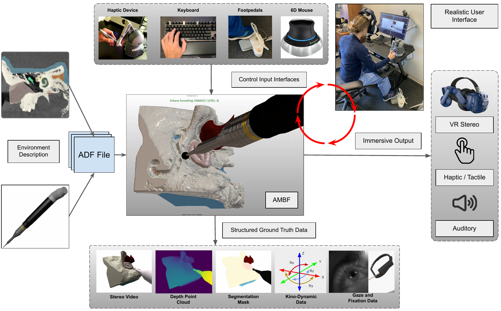
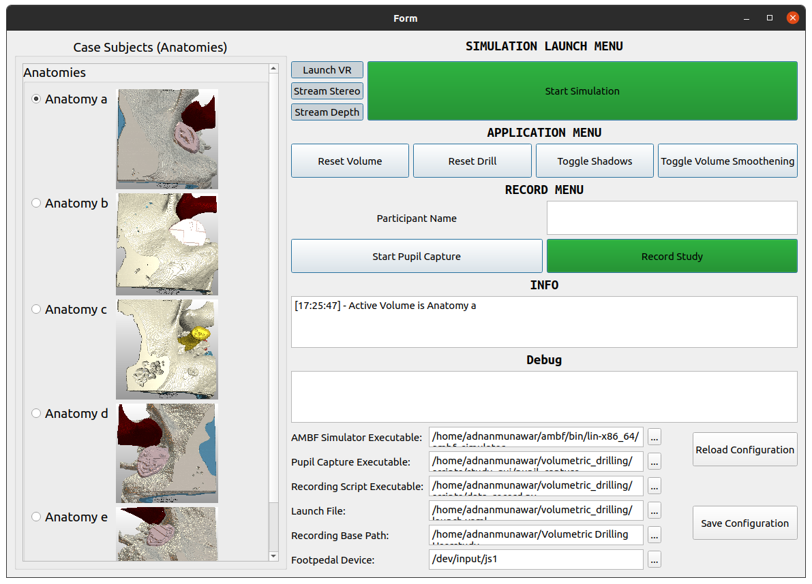

# Fully Immersive Virtual Reality For Skull Base Surgery (FIVRS)
### [News Coverage](https://techxplore.com/news/2021-12-virtual-reality-simulator-surgeons-skull-base.html) | [FIVRS Paper](https://link.springer.com/article/10.1007/s11548-023-02956-5) | [Original Paper](https://www.tandfonline.com/doi/full/10.1080/21681163.2021.1999331) | [Video](https://youtu.be/36pYIt1KGs4)

This repo provides a virtual drilling simulator for various surgical applications.

## 1. Overview

The virtual reality drilling simulator is able to actively modify anatomy with a virtual drill. The simulator has both VR and haptics integration as well as the ability to generate data for use in downstream algorithm development. Volumetric_drilling is a plugin built on top of Asynchronous Multibody Framework ([AMBF](https://github.com/WPI-AIM/ambf)) developed by Munawar et al. We show the use of the plugin in lateral skull base surgery. 



## 2. Installation Instructions

### 2.1 Install and Source AMBF 3.0

Clone, build and source `ambf-3.0` branch using these [instructions](https://github.com/WPI-AIM/ambf/wiki/Installing-AMBF).

Note that depth and image recording are enabled by default (in camera ADFs) and these features only work on Linux with ROS installed. Additionally, the following packages must be installed prior to building to AMBF:

```bash
cv-bridge # Can be installed via apt install ros-<version>-cv-bridge
image-transport # Can be installed via apt install ros-<version>-image-transport
```

### 2.2 Clone and Build Drilling Simulator
Clone this repository to your ROS workspace, this workspace could be the same as where you placed [AMBF](https://github.com/WPI-AIM/ambf/wiki/Installing-AMBF) e.g. `ros_ambf_ws`

``` bash
cd ~/ros_ambf_ws/src
git clone https://github.com/LCSR-SICKKIDS/volumetric_drilling
```

Now build with the default ROS build tool, which could be either `catkin` or `colcon`

```bash
cd ~/ros_ambf_ws
catkin_make
```

For ROS 2
``` bash
cd ~/ros_ambf_ws
colcon build
```

After a successful build, remember to source the ROS workspace. Here is an [example](https://github.com/WPI-AIM/ambf/wiki/Installing-AMBF#step-4-optional-but-recommended)
 from AMBF on how to source the ROS workspace
## 3 Running FIVRS with an intuitive GUI
Navigate to the scripts folder

```bash
cd ~/ros_ambf_ws/src/volumetric_drilling/scripts
python3 study_gui.py
```
This should open up this GUI which should be self explanatory




## 4 Running FIVRS the old way (for finer control and for adding or tweaking features)

The volumetric drilling simulator is a plugin that is launched on top of the AMBF simulator along with other AMBF bodies, described by AMBF Description Format files (ADFs), as will be demonstrated below. The `libvolumetric_drilling.so` plugin is initialized in the `launch.yaml` file and can be commented out for the purpose of debugging the ADF files.   

Below are instructions as to how to load different volume and camera options. The -l tag used below allows user to run indexed multibodies that can also be found in the `launch.yaml` under the `multibody configs:` data block. More info on launching the simulator can be found in the AMBF Wiki:  

https://github.com/WPI-AIM/ambf/wiki/Launching-the-Simulator  
https://github.com/WPI-AIM/ambf/wiki/Selecting-Robots  
https://github.com/WPI-AIM/ambf/wiki/Command-Line-Arguments  

Note that the executable binary,`ambf_simulator`, is located in `ambf/bin/lin-x86_64` and you must be in that folder to run the simulator.

### 4.1 Different Volume Options
We provide three different volumes to choose from:

#### Option 1:
A low res volume (`1`) and a drill (`0`):
```bash
cd ambf/bin/lin-x86_64/
./ambf_simulator --launch_file <volumetric_plugin_path>/launch.yaml -l 0,1
```

#### Option 2:
A medium res volume (`2`) and a drill (`0`):
```bash
cd ambf/bin/lin-x86_64/
./ambf_simulator --launch_file <volumetric_plugin_path>/launch.yaml -l 0,2
```

#### Option 3:
A high res volume (`3`) and a drill (`0`):
```bash
cd ambf/bin/lin-x86_64/
./ambf_simulator --launch_file <volumetric_plugin_path>/launch.yaml -l 0,3
```
#### Option 4: User-provided volume
Patient specific anatomy may also be used in the simulator. The volumes are an array of images (JPG or PNG) that are rendered via texture-based volume rendering. With images and an ADF for the volume, user specified anatomy can easily be used in the simulator. We provide utility scripts (located in the `scripts` folder) that can convert both segmented and non-segmented data from the NRRD format to an array of images.

### 4.2 Camera Options
Different cameras, defined via ADF model files, can be loaded alongside the simulation.

#### Option 1
You can add `4` to any of the above commands to load a segmentation_camera. This camera publishes a segmented depth point cloud. Launch example:
```bash
cd ambf/bin/lin-x86_64/
./ambf_simulator --launch_file <volumetric_plugin_path>/launch.yaml -l 0,1,4
```
#### Option 2
You can add `5` to any of the above commands to load two cameras (one of each stereo eye). Each of these cameras publishes its video. Launch example:
```bash
cd ambf/bin/lin-x86_64/
./ambf_simulator --launch_file <volumetric_plugin_path>/launch.yaml -l 0,1,5
```

#### Option 1 and 2 combined
You can also load both the segmentation_camera and the two stereo_cameras together as:
```bash
cd ambf/bin/lin-x86_64/
./ambf_simulator --launch_file <volumetric_plugin_path>/launch.yaml -l 0,1,4,5
```
### 4.3 Changing Scene Parameters
All the relevant ADF scene objects are in the ADF folder and can be modified as needed. For example, camera intrinsics can be adjusted via the field view angle and image resolution parameters of Camera ADFs.

### 4.4 Manipulating Drill
The virtual drill can be manipulated via a keyboard or haptic devices such as the Geomagic Touch/Phantom Omni.

#### 4.4.1 Keyboard Navigation

| # | Linear Motion of Tool | Description                                  |
|---|-----------------------|----------------------------------------------|
| 1 | [Ctrl+W]              | Moves vertically upward w.r.t. camera        |
| 2 | [Ctrl+S]              | Moves vertically downward w.r.t. camera      |
| 3 | [Ctrl+A]              | Moves horizontally left w.r.t. camera        |
| 4 | [Ctrl+D]              | Moves horizontally right w.r.t. camera       |
| 5 | [Ctrl+I]              | Moves in the forward direction w.r.t camera  |
| 6 | [Ctrl+K]              | Moves in the backward direction w.r.t camera |


| # | Angular Motion of Tool | Description                                     |
|---|------------------------|-------------------------------------------------|
| 1 | [Num 8]                | Rotates towards upward direction w.r.t tool     |
| 2 | [Num 5]                | Rotates towards downward direction w.r.t. tool  |
| 3 | [Num 4]                | Rotates towards the left direction w.r.t. tool  |
| 4 | [Num 6]                | Rotates towards the right direction w.r.t. tool |


| # | Miscellaneous | Description                                                                        |
|---|---------------|------------------------------------------------------------------------------------|
| 1 | [Ctrl+O (letter o)]      | Toggle the drill's control mode between Haptic Device / Keyboard to ROS Comm       |
| 1 | [C]      | Changes the size of drill burr/ radius of tip sphere (2 mm, 4 mm, and, 6 mm)       |
| 2 | [Ctrl+N]      | Resets the shape of the volume                                                     |
| 3 | [Alt+R]       | Resets the whole world and this plugin                                             |
| 2 | [X]           | Toggles the functionality of sudden jumping of drill mesh towards the followSphere |
| 3 | [B]           | Toggles the visibility of drill mesh in the scene                                  |
| 4 | [Ctrl+C] | Toggles the visbility of collision spheres | 

#### 4.4.2 Geomagic Touch/Phantom Omni
TODO

### 4.4.3 Camera Movement
Camera movement in the simulator can be accomplished through AMBF's python client, mouse movement or Head Mounted Displays (HMDs)

#### 4.4.3.1 AMBF Python Client
Camera can be moved with the AMBF python client as described here: https://github.com/WPI-AIM/ambf/wiki/The-Python-Client. To move all cameras in sync the object that should be moved is the parent of all the cameras, `main_camera`.  
Note that only one instance of the AMBF python client can be opened at a time. The data generation script uses the python client, hence camera movement must be added to that script if data is also being recorded.

#### 4.4.3.2 Mouse Movement
Navigation using mouse shortcuts in AMBF is described here: https://github.com/WPI-AIM/ambf/wiki/Keyboard-and-Mouse-Shortcuts

#### 4.4.3.3 HMDs
TODO

### 4.6 Data Recording
A python script (`scripts/data_record.py`) is provided to record data based on the user's configuration. By default, the left and right stereo images, depth point cloud, segmentation mask, drill/camera poses, removed voxels and drill burr changes are recorded. The data is stored as a convenient and well-organized hdf5 file.
**NOTE:** 
- Make sure to source the ROS workspace
- By default, data recording should be launched after the simulator. We perform sanity check on this to make sure topics subscribed are meaningful.

## 5 Citation
If you found this work helpful, please use the following citations:

```
@article{munawar2024fully,
  title={Fully immersive virtual reality for skull-base surgery: surgical training and beyond},
  author={Munawar, Adnan and Li, Zhaoshuo and Nagururu, Nimesh and Trakimas, Danielle and Kazanzides, Peter and Taylor, Russell H and Creighton, Francis X},
  journal={International journal of computer assisted radiology and surgery},
  volume={19},
  number={1},
  pages={51--59},
  year={2024},
  publisher={Springer}
}
```

```
@article{munawar2021virtual,
  title={Virtual reality for synergistic surgical training and data generation},
  author={Munawar, Adnan and Li, Zhaoshuo and Kunjam, Punit and Nagururu, Nimesh and Ding, Andy S and Kazanzides, Peter and Looi, Thomas and Creighton, Francis X and Taylor, Russell H and Unberath, Mathias},
  journal={Computer Methods in Biomechanics and Biomedical Engineering: Imaging \& Visualization},
  pages={1--9},
  year={2021},
  publisher={Taylor \& Francis}
}
```
